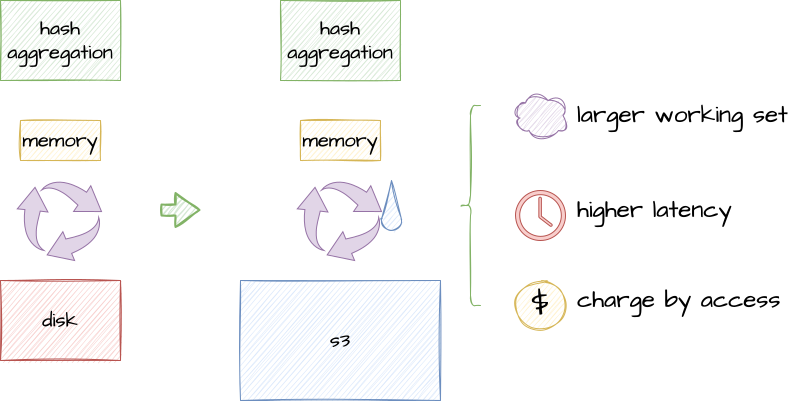
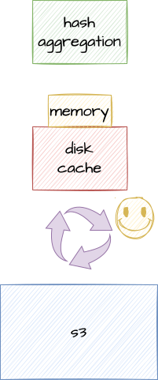

# Overview

  

## What is foyer?

***foyer***, just as its slogan, is a hybrid cache library for the Rust programming language. 🦀

## What is hybrid cache?

A hybrid cache is a caching system that utilizes both memory and disk storage simultaneously. It is commonly used to extend the insufficient memory cache for the system uses Object Store Service (OSS, e.g. AWS S3) as its primary data storage[^oss-dia] to **improve performance** and **reduce costs**[^risingwave].

## Why we need a hybrid cache?

More and more systems are using OSS as their primary data storage. OSS has many great features, such as low storage cost, high availability and durability, and almost unlimited scalability.

However, there are also downsides with OSS. For example, the latency is high and uncontrollable, and its price increases with each accesses. The downsides will be further amplified in a large working set because of more data exchange between cache and OSS.

  
  

With a hybrid cache, the ability to cache the working set can be extended from memory only to memory and disk. This can reduce data exchange between cache and OSS, thereby improving performance and reducing costs.

  

[^oss-dia]: Systems using OSS as its primary data storage: [RisingWave](https://github.com/risingwavelabs/risingwave), [Chroma Cloud](https://github.com/chroma-core/chroma), [SlateDB](https://github.com/slatedb/slatedb), etc.

[^risingwave]: How streaming database RisingWave use foyer to improve performance and reduce costs: [Showcase - RisingWave](/docs/showcase/risingwave).